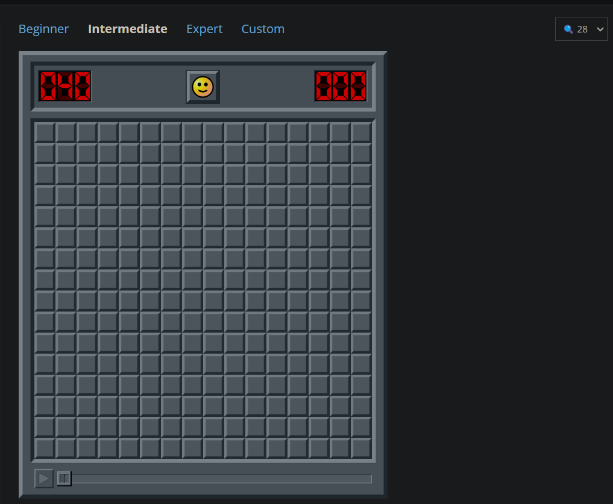

<h1>Disclaimer</h1>
I made this tool for fun to try and see if it can solve minesweeper online <b>intermediates.</b> I will be maintaining this until I get bored. Please don't use this to cheat, this was just a fun project for me. Yes I know it can be faster if I use CUDA, no I don't care about doing so as I will need to rebuild it or use Docker. Yes I know there are ways to improve upon it to make finish in half the time or more.

<h2>What it can and cannot do</h2>
It can auto set flags where the bombs are.  
It can click where the safe spots are.  
It cannot solve edge cases because I found it wasn't worth my time.  
It can run, but cannot solve expert, but there's edge cases not seen in intermediate.  

<h2>Setup</h2>
I highly recommend venv  
<b>I expect https://minesweeper.online/ and to be playing intermediate and zoom size of 28. This is important. </b>

 
Example of what it expects:

1. `pip install -r -requirements.txt`
1. Make sure you select a few to give it the program a heads start. I will not randomly select spots for you.
1. `python3 solver.py`

<h2>Video of it in action:</h2>
I gave it a start first, then I ran the script on another screen.
It can solve the guarantees, but on some edge cases, it will stop. The user will have to manually set themselves. They can start the program again once it finds cases it can solve.

https://youtu.be/nybezTAA8yo

<h2>Developer Notes</h2>
1. The zoom set at 28 makes each box 35x35 pixels.  
1. There's a template that searches for this exact grid and returns the top left x and y.  
1. It then roughly is able to use this relative point to calculate the midpoint to click for each square.  
1. If one changes the zoom size, the 35x35 pixel is no longer valid and will have to be modified so it works again.